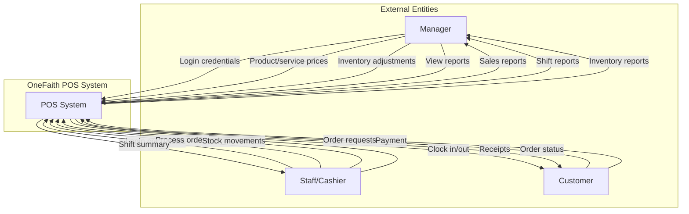

# Data Flow Diagram (DFD)

This document shows the data flows for the OneFaith POS system.

## Level 0: Context Diagram



## Level 1: System Overview

```mermaid
flowchart TB
    subgraph External["External Entities"]nline
        Manager["Manager"]
        Staff["Staff"]
        Customer["Customer"]
    end

    subgraph Processes["Core Processes"]
        P1["1.0<br/>Authentication<br/>& Authorization"]
        P2["2.0<br/>Order<br/>Management"]
        P3["3.0<br/>Inventory<br/>Management"]
        P4["4.0<br/>Reporting<br/>& Analytics"]
        P5["5.0<br/>Shift<br/>Management"]
        P6["6.0<br/>Carwash<br/>Services"]
    end

    subgraph DataStores["Data Stores"]
        D1[("D1: USERS")]
        D2[("D2: ORDERS")]
        D3[("D3: ORDER_ITEMS")]
        D4[("D4: PRODUCTS")]
        D5[("D5: INGREDIENTS")]
        D6[("D6: STOCK_MOVEMENTS")]
        D7[("D7: SHIFTS")]
        D8[("D8: CARWASH_SERVICES")]
        D9[("D9: CARWASH_CATALOG")]
    end

    %% Authentication flows
    Manager -->|Login request| P1
    Staff -->|Login request| P1
    P1 <-->|User credentials| D1
    P1 -->|JWT token + role| Manager
    P1 -->|JWT token + role| Staff

    %% Order flows
    Staff -->|Create order| P2
    Customer -->|Order details| P2
    P2 -->|Store order| D2
    P2 -->|Store line items| D3
    P2 <-->|Product info| D4
    P2 -->|Receipt| Customer

    %% Inventory flows
    Manager -->|Add/Edit products| P3
    Staff -->|Stock IN/OUT/AUDIT| P3
    P3 <-->|Product data| D4
    P3 <-->|Ingredient data| D5
    P3 -->|Record movements| D6
    P3 -->|Stock status| Manager
    P3 -->|Stock status| Staff

    %% Reporting flows
    Manager -->|Request reports| P4
    P4 <-->|Sales data| D2
    P4 <-->|Order details| D3
    P4 <-->|Shift data| D7
    P4 <-->|User data| D1
    P4 -->|Analytics| Manager

    %% Shift flows
    Staff -->|Clock in/out| P5
    P5 -->|Create/Update shift| D7
    P5 <-->|User info| D1
    P5 -->|Shift summary| Staff
    P5 -->|Link orders to shift| D2

    %% Carwash flows
    Staff -->|Create service| P6
    Customer -->|Service request| P6
    P6 -->|Store ticket| D8
    P6 <-->|Service catalog| D9
    P6 -->|Update status| D8
    P6 -->|Link to order| D2
    P6 -->|Service status| Customer
```

## Data Flow Summary

### Core Processes

1. **Authentication & Authorization (1.0)**: User login with JWT token generation based on role (manager/staff)

2. **Order Management (2.0)**: Process Coffee and Carwash orders, create order records and line items

3. **Inventory Management (3.0)**: Manage products and ingredients, record stock movements (IN/OUT/AUDIT)

4. **Reporting & Analytics (4.0)**: Generate sales reports, analytics by business unit, date range filtering

5. **Shift Management (5.0)**: Clock in/out functionality, track active shifts, link orders to shifts

6. **Carwash Services (6.0)**: Create service tickets, manage service queue, link to payment records

### Data Store Summary

| Data Store           | Purpose                           | Main Relationships                               |
| -------------------- | --------------------------------- | ------------------------------------------------ |
| D1: USERS            | User accounts and authentication  | → SHIFTS, ORDERS, STOCK_MOVEMENTS                |
| D2: ORDERS           | Payment transactions              | ← USERS, SHIFTS; → ORDER_ITEMS, CARWASH_SERVICES |
| D3: ORDER_ITEMS      | Line items per order              | ← ORDERS, PRODUCTS                               |
| D4: PRODUCTS         | Coffee product catalog            | → ORDER_ITEMS                                    |
| D5: INGREDIENTS      | Inventory items                   | → STOCK_MOVEMENTS                                |
| D6: STOCK_MOVEMENTS  | Inventory tracking (IN/OUT/AUDIT) | ← INGREDIENTS, USERS                             |
| D7: SHIFTS           | Staff shift records               | ← USERS; → ORDERS                                |
| D8: CARWASH_SERVICES | Service tickets and queue         | ← ORDERS                                         |
| D9: CARWASH_CATALOG  | Carwash service definitions       | → CARWASH_SERVICES                               |

### Key Data Transformations

1. **Order Totals**: `subtotal - discount = total`
2. **Stock Calculation**: `latest_audit + SUM(IN movements) - SUM(OUT movements) = current_stock`
3. **Sales Aggregation**: `GROUP BY order_id, json_agg(order_items) = nested order structure`
4. **Shift Duration**: `end_time - start_time = hours worked`

### Security & Authorization

- **JWT Token Flow**: Login → Generate token → Include in request headers → Validate on each request
- **Role-Based Access**:
  - **Manager**: Full access to all processes and data stores
  - **Staff**: Limited to POS operations, inventory movements, and own shift data
- **Data Isolation**: Users can only manage their own shifts, all financial data logged with user_id

### Technology Stack

- **Frontend**: Next.js (React) - User interface
- **API**: Express.js REST API - Business logic
- **Database**: PostgreSQL (Neon) - Data persistence
- **Authentication**: JWT tokens - Stateless sessions
