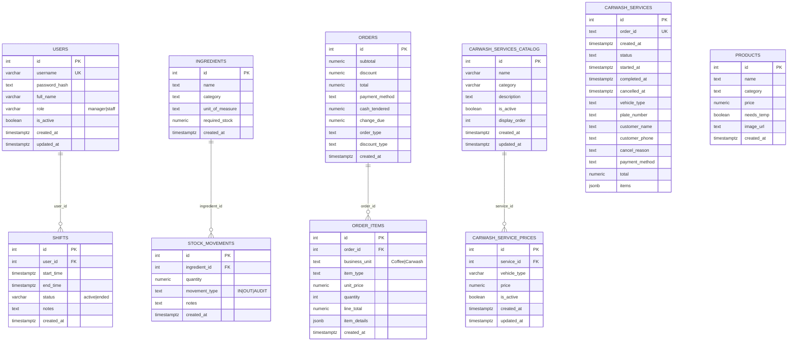

# Database ERD

Below is the current entity-relationship diagram for the OneFaith POS backend. The diagram is written in Mermaid and should render directly on GitHub.



## Notes and constraints

**Timestamps**: All timestamps use `TIMESTAMPTZ` (timezone-aware) for consistency and to prevent timezone bugs.

**Foreign keys**:

- `shifts.user_id` → `users(id)` with `ON DELETE CASCADE`
- `stock_movements.ingredient_id` → `ingredients(id)` with `ON DELETE CASCADE`
- `order_items.order_id` → `orders(id)` with `ON DELETE CASCADE`
- `carwash_service_prices.service_id` → `carwash_services_catalog(id)` with `ON DELETE CASCADE`

**Unique constraints**:

- `users.username` - database-level unique index
- `carwash_services.order_id` - unique text identifier
- `carwash_service_prices(service_id, vehicle_type)` - prevents duplicate vehicle prices per service
- `shifts(user_id) WHERE status='active'` - partial unique index ensures only one active shift per user

**Check constraints**:

- `users.role` IN ('manager', 'staff')
- `shifts.status` IN ('active', 'ended')
- `stock_movements.movement_type` IN ('IN', 'OUT', 'AUDIT')
- `order_items.business_unit` IN ('Coffee', 'Carwash')

**Indexes for performance**:

- `idx_shifts_user_id`, `idx_shifts_status`
- `idx_stock_movements_ingredient_id`, `idx_stock_movements_created_at`
- `idx_orders_created_at`, `idx_orders_payment_method`
- `idx_order_items_order_id`, `idx_order_items_business_unit`
- `idx_products_category`, `idx_ingredients_category`
- `idx_carwash_services_status` (partial: WHERE status != 'completed')
- `idx_carwash_catalog_active`, `idx_carwash_prices_service`, `idx_carwash_prices_active`

**JSONB fields**:

- `order_items.item_details` - flexible payload for Coffee (option) and Carwash (vehicle) details
- `carwash_services.items` - array of service line items

## Migration

To standardize your existing database to this schema, run:

```bash
# Standard schema migration (timestamps, table definitions, constraints)
node migrate_standardize_schema.js

# Carwash services catalog migration (new feature)
node migrate_carwash_catalog.js
```

node migrate_standardize_schema.js

```

This will:
1. Convert shifts table timestamps from `TIMESTAMP` to `TIMESTAMPTZ`
2. Create any missing table definitions
3. Add all recommended indexes and constraints
4. Ensure data integrity across all tables

## Source of truth

All tables are explicitly defined in:
- `backend/create_users_table.js` - users table
- `backend/create_shifts_table.js` - shifts table (now with TIMESTAMPTZ)
- `backend/migrate_standardize_schema.js` - complete schema with all tables, indexes, and constraints

Table creation is also handled by:
- `backend/carwash_routes.js` - carwash_services table with auto-migrations
- `backend/order_routes.js` - orders/order_items created inline during first order

**Recommended**: Run the migration script on your production database to ensure consistency.
```
