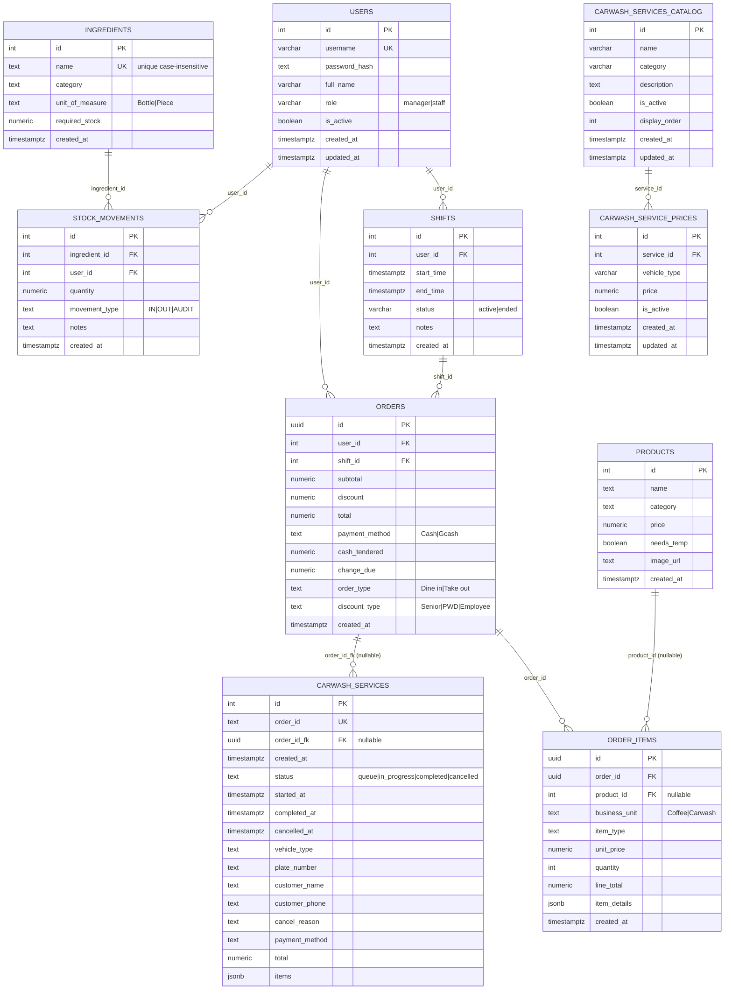

# Database ERD

Below is the current entity-relationship diagram for the OneFaith POS backend with full entity linking for traceability and reporting.



## Notes and constraints

**Timestamps**: All timestamps use `TIMESTAMPTZ` (timezone-aware) for consistency and to prevent timezone bugs.

**Foreign keys (with NOT VALID for backward compatibility)**:

- `shifts.user_id` → `users(id)` with `ON DELETE CASCADE`
- `orders.user_id` → `users(id)` - tracks which cashier processed the order
- `orders.shift_id` → `shifts(id)` - links orders to active shifts for shift reports
- `order_items.order_id` → `orders(id)` with `ON DELETE CASCADE`
- `order_items.product_id` → `products(id)` - nullable, links Coffee sales to product catalog
- `stock_movements.ingredient_id` → `ingredients(id)` with `ON DELETE CASCADE`
- `stock_movements.user_id` → `users(id)` - tracks who performed inventory adjustments
- `carwash_services.order_id_fk` → `orders(id)` - nullable, links carwash jobs to payment records
- `carwash_service_prices.service_id` → `carwash_services_catalog(id)` with `ON DELETE CASCADE`

**Unique constraints**:

- `users.username` - database-level unique index
- `ingredients.name` - case-insensitive unique index (`LOWER(name)`)
- `carwash_services.order_id` - unique text identifier for service tickets
- `carwash_service_prices(service_id, vehicle_type)` - prevents duplicate vehicle prices per service
- `shifts(user_id) WHERE status='active'` - partial unique index ensures only one active shift per user

**Check constraints**:

- `users.role` IN ('manager', 'staff')
- `shifts.status` IN ('active', 'ended')
- `stock_movements.movement_type` IN ('IN', 'OUT', 'AUDIT')
- `order_items.business_unit` IN ('Coffee', 'Carwash')
- `carwash_services.status` IN ('queue', 'in_progress', 'completed', 'cancelled')

**Indexes for performance**:

- `idx_orders_user_id`, `idx_orders_shift_id`, `idx_orders_created_at`, `idx_orders_payment_method`
- `idx_order_items_order_id`, `idx_order_items_product_id`, `idx_order_items_business_unit`
- `idx_shifts_user_id`, `idx_shifts_status`
- `idx_stock_movements_ingredient_id`, `idx_stock_movements_user_id`, `idx_stock_movements_created_at`
- `idx_products_category`, `idx_ingredients_category`
- `idx_carwash_services_order_id_fk`, `idx_carwash_services_status` (partial: WHERE status != 'completed')
- `idx_carwash_catalog_active`, `idx_carwash_prices_service`, `idx_carwash_prices_active`

**JSONB fields**:

- `order_items.item_details` - flexible payload for Coffee (option: Hot/Cold) and Carwash (vehicle) details
- `carwash_services.items` - array of service line items with pricing snapshot

**Key design decisions**:

1. **UUID for orders**: Uses UUID primary keys for orders and order_items to avoid ID collisions and enable distributed ID generation
2. **Price snapshots**: `order_items.unit_price` and `line_total` preserve historical pricing even when product prices change
3. **Nullable FKs**: Optional links (`product_id`, `order_id_fk`, `user_id`, `shift_id`) allow legacy data and gradual adoption
4. **Manual inventory**: Stock movements are recorded explicitly via IN/OUT/AUDIT (no automatic deduction from sales)
5. **Carwash dual identifiers**: `order_id` (text) for human-readable tickets + `order_id_fk` (UUID) for database linkage

## Migration

To implement the connected ERD linking on your existing database:

```bash
# Run migrations in Neon SQL Editor (in order):
# 1. Add columns and regular indexes
psql < migrations/2025-11-06_connected_links_step1.sql

# 2. Add unique index on ingredients (CONCURRENTLY)
psql < migrations/2025-11-06_connected_links_step2.sql

# 3. Add NOT VALID foreign keys
psql < migrations/2025-11-06_connected_links_step3.sql

# 4. (Optional) Validate FKs after data is clean
psql < migrations/2025-11-06_connected_links_step4_validate.sql
```

This will:
1. Add nullable columns: `orders.user_id`, `orders.shift_id`, `order_items.product_id`, `carwash_services.order_id_fk`, `stock_movements.user_id`
2. Create indexes for performance on new columns
3. Add NOT VALID foreign keys (won't block on legacy data)
4. Optionally validate constraints after data cleanup

## What you can now do with this schema

**Sales Analytics:**
- Track sales by cashier, shift, and time period
- Identify top-selling products (via `order_items.product_id`)
- Compare Coffee vs Carwash revenue by business unit

**Inventory Auditing:**
- See who performed each stock adjustment (`stock_movements.user_id`)
- Enforce unique ingredient names (case-insensitive)
- Track ingredient usage over time

**Customer History:**
- Link carwash service jobs to payment records (`carwash_services.order_id_fk`)
- View complete customer transaction history
- Generate customer-specific reports

**Operational Reports:**
- Shift-based sales reports (when shifts are tracked)
- Cashier performance metrics
- Real-time product inventory alerts

## Source of truth

All tables are explicitly defined in:
- `backend/create_users_table.js` - users table
- `backend/create_shifts_table.js` - shifts table (now with TIMESTAMPTZ)
- `backend/migrate_standardize_schema.js` - complete schema with all tables, indexes, and constraints

Table creation is also handled by:
- `backend/carwash_routes.js` - carwash_services table with auto-migrations
- `backend/order_routes.js` - orders/order_items created inline during first order

**Recommended**: Run the migration script on your production database to ensure consistency.
```
