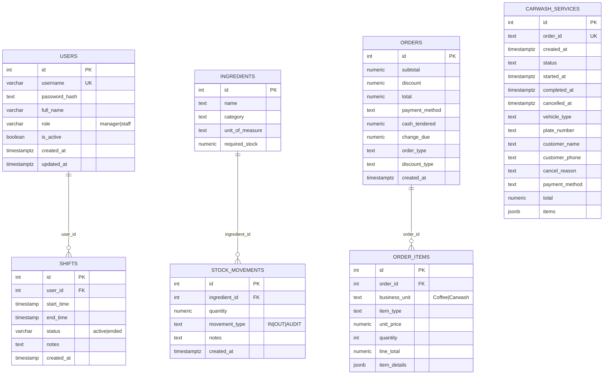

# Database ERD

Below is the current entity-relationship diagram for the OneFaith POS backend. The diagram is written in Mermaid and should render directly on GitHub.

## Notes and constraints

- users.username has a UNIQUE constraint (DB-level) in addition to API checks.
- shifts.user_id references users(id) with ON DELETE CASCADE.
- carwash_services.order_id is UNIQUE; there is no FK to orders because carwash tickets may be created before payment.
- order_items.item_details and carwash_services.items are JSONB for flexible payloads.
- Consider adding this index for stronger data integrity:
  - Unique active shift per user: `CREATE UNIQUE INDEX IF NOT EXISTS uniq_active_shift_per_user ON shifts(user_id) WHERE status = 'active';`

## Source of truth

- Defined from the code in:
  - `backend/create_users_table.js`
  - `backend/create_shifts_table.js`
  - `backend/ingredient_routes.js` (implied schema for ingredients and stock_movements)
  - `backend/product_routes.js` (products table is independent and not referenced by orders)
  - `backend/order_routes.js` (orders and order_items)
  - `backend/carwash_routes.js` (carwash_services)
