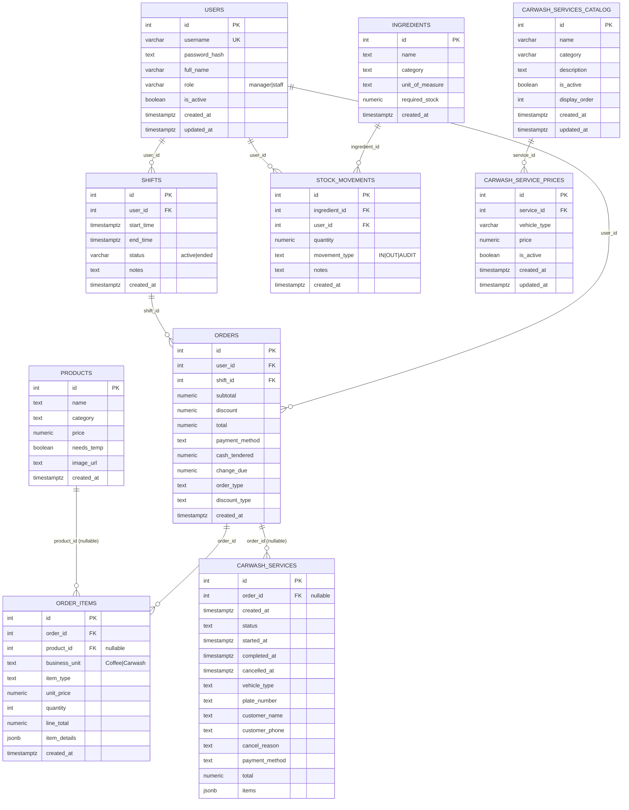

# Proposed Connected ERD (Enhanced Linking)

This is an optional, more connected design that links sales, inventory, users, and carwash records end‑to‑end. It keeps historical prices safe while enabling richer reporting. Note: automatic inventory deduction is NOT included; inventory remains manual via stock movements.

## What this enables

- Traceability and reporting

  - Attribute orders to users and shifts (sales per cashier/shift).
  - Join order items to products for analytics while preserving price snapshots (unit_price stays on order_items).
  - Link carwash service jobs to orders after payment, keeping operational timelines separate.

- Manual inventory control

  - Inventory adjustments are recorded via IN/OUT/AUDIT stock movements only (no automatic deduction from sales).

- Cleaner auditing
  - STOCK_MOVEMENTS have user_id for who performed the action.
  - Foreign keys prevent orphan rows and allow safe cascades where appropriate.

## Constraints and indexes

- New FKs/indexes (recommended):

  - orders.user_id → users(id), index on orders(user_id)
  - orders.shift_id → shifts(id), index on orders(shift_id)
  - order_items.product_id → products(id) (NULL allowed), index on order_items(product_id)
  - carwash_services.order_id → orders(id) (NULL allowed), index on carwash_services(order_id)
  - stock_movements.user_id → users(id), index on stock_movements(user_id)
  - DB-level uniqueness for ingredients: unique index on LOWER(name)

- Keep these existing constraints:
  - shifts: partial unique index one active shift per user
  - carwash_service_prices: unique(service_id, vehicle_type)
  - check constraints for enums (role, status, movement_type, business_unit)

## Migration approach (safe rollout)

1. Schema changes (add columns nullable):

- orders.user_id, orders.shift_id
- order_items.product_id (nullable)
- carwash_services.order_id (nullable)
- stock_movements.user_id (nullable)

2. Add FKs as NOT VALID, then VALIDATE to avoid long locks.
3. Backfill values where known (e.g., current active shift to orders).
4. Update app to write new columns.
5. Keep inventory adjustments manual via stock movements.

## Notes

- History safety: even with product_id, keep unit_price and item_type on order_items to preserve the exact sale value at the time of purchase.
- Optional links: carwash_services.order_id and order_items.product_id can remain NULL for legacy data or workflows where linkage isn’t applicable.
- Soft deletes: prefer deactivating products/services instead of hard deletes to keep FK integrity for historical orders.
- No automatic inventory: sales do not impact ingredient stock automatically; continue to use IN/OUT/AUDIT entries.
